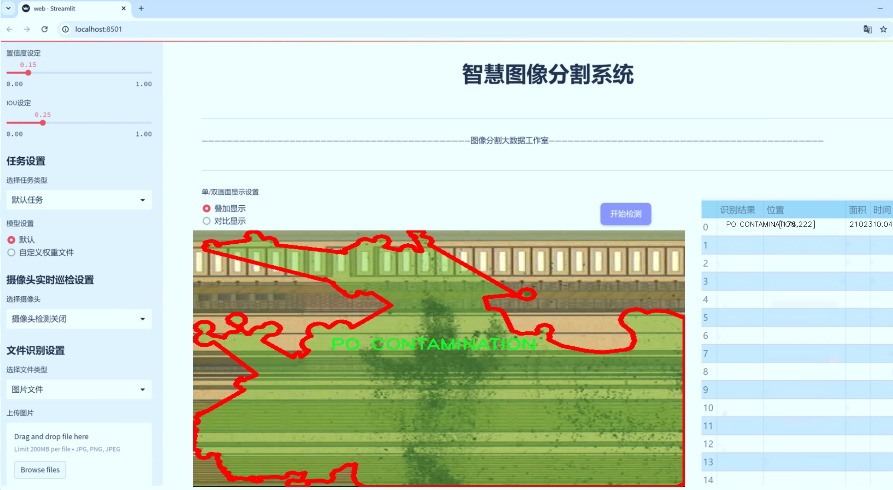
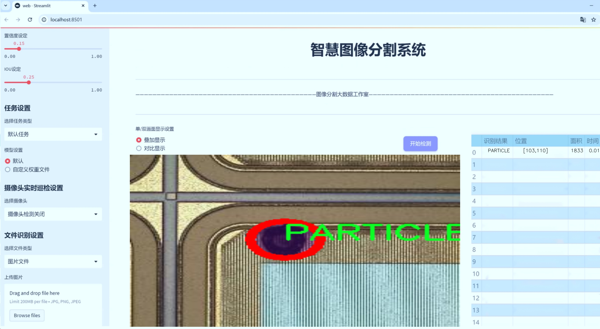
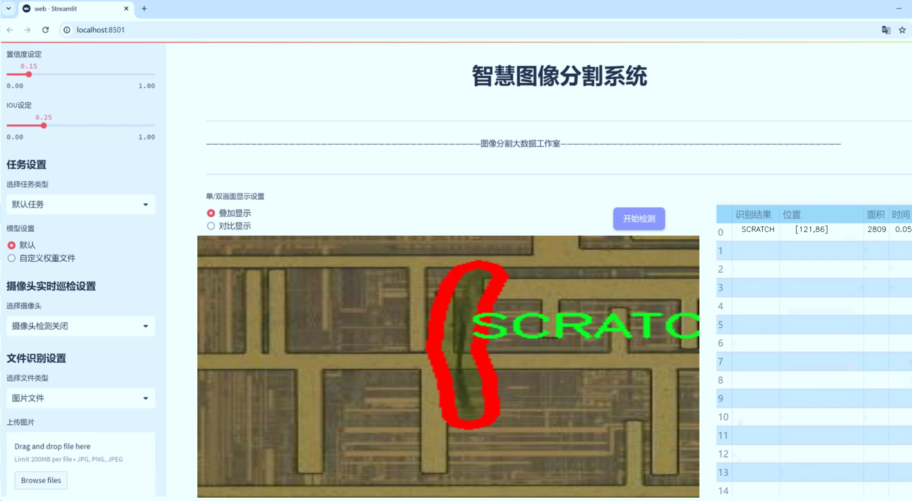
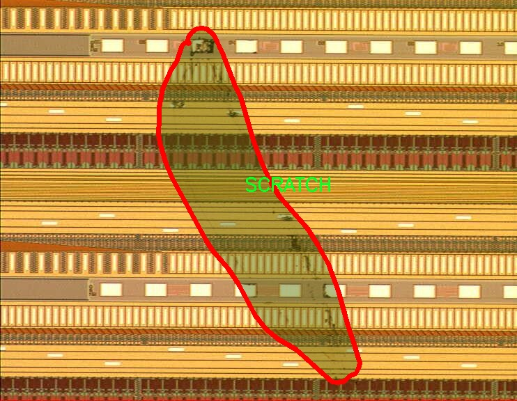
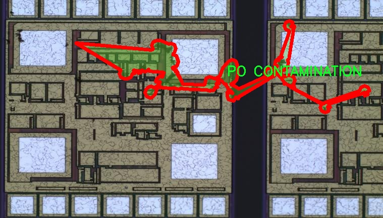
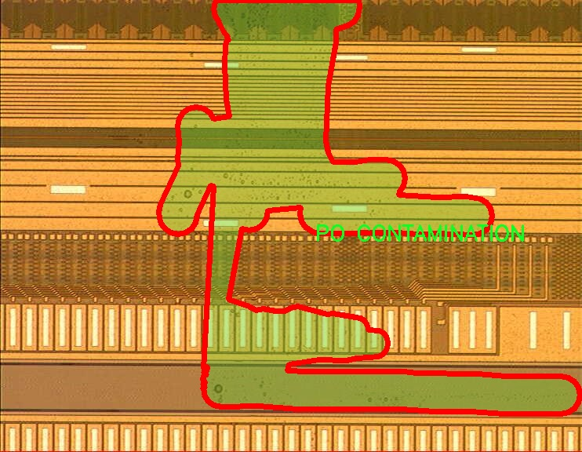
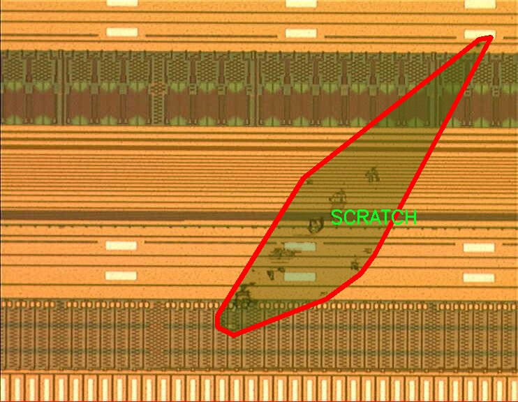
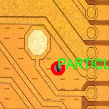

# 晶圆缺陷分割系统源码＆数据集分享
 [yolov8-seg-C2f-Faster-EMA＆yolov8-seg-KernelWarehouse等50+全套改进创新点发刊_一键训练教程_Web前端展示]

### 1.研究背景与意义

项目参考[ILSVRC ImageNet Large Scale Visual Recognition Challenge](https://gitee.com/YOLOv8_YOLOv11_Segmentation_Studio/projects)

项目来源[AAAI Global Al lnnovation Contest](https://kdocs.cn/l/cszuIiCKVNis)

研究背景与意义

随着半导体行业的迅猛发展，晶圆制造过程中的缺陷检测和分割技术愈发重要。晶圆作为半导体器件的基础，其表面缺陷的存在直接影响到后续的电路设计和产品性能。因此，开发高效、准确的缺陷检测系统成为提升晶圆制造质量的关键环节。近年来，深度学习技术的快速进步为图像处理和缺陷检测提供了新的解决方案，尤其是基于卷积神经网络（CNN）的目标检测和分割模型，如YOLO（You Only Look Once）系列，因其高效性和实时性而受到广泛关注。

YOLOv8作为YOLO系列的最新版本，具备了更强的特征提取能力和更快的推理速度，适合于复杂场景下的目标检测任务。然而，针对晶圆缺陷的特定需求，YOLOv8的标准模型在分割精度和细节处理上仍存在一定的局限性。因此，基于YOLOv8的改进模型，特别是针对晶圆缺陷的实例分割任务，具有重要的研究价值和实际应用意义。

本研究将利用包含4500张图像的晶圆缺陷数据集，涵盖了七种不同类别的缺陷，包括BLOCK ETCH、COATING BAD、PARTICLE、PIQ PARTICLE、PO CONTAMINATION、SCRATCH和SEZ BURNT。这些缺陷类型不仅反映了晶圆在制造过程中可能出现的各种问题，也为模型的训练和评估提供了丰富的样本基础。通过对这些数据的深入分析和处理，可以为模型的改进提供切实可行的方向。

在研究过程中，我们将针对YOLOv8的特性，设计一系列改进策略，以提升其在晶圆缺陷分割任务中的表现。这些策略可能包括网络结构的优化、损失函数的调整以及数据增强技术的应用等。通过这些改进，我们期望能够实现更高的分割精度和更好的实时性能，从而为晶圆制造过程中的缺陷检测提供更为可靠的技术支持。

此外，随着半导体行业对自动化和智能化的不断追求，基于深度学习的缺陷检测系统将成为未来制造流程的重要组成部分。通过本研究的实施，不仅能够为晶圆缺陷检测提供一种新的解决方案，还能够为相关领域的研究者提供有价值的参考和借鉴。最终，我们希望通过本研究的成果，推动晶圆制造行业的技术进步，提高产品的良率和可靠性，为整个半导体产业链的健康发展贡献力量。

综上所述，基于改进YOLOv8的晶圆缺陷分割系统的研究，不仅具有重要的理论意义，也具备广泛的应用前景。通过深入探索和实践，我们期待为晶圆制造过程中的缺陷检测提供更为高效和准确的技术手段，助力半导体行业的持续创新与发展。

### 2.图片演示







##### 注意：由于此博客编辑较早，上面“2.图片演示”和“3.视频演示”展示的系统图片或者视频可能为老版本，新版本在老版本的基础上升级如下：（实际效果以升级的新版本为准）

  （1）适配了YOLOV8的“目标检测”模型和“实例分割”模型，通过加载相应的权重（.pt）文件即可自适应加载模型。

  （2）支持“图片识别”、“视频识别”、“摄像头实时识别”三种识别模式。

  （3）支持“图片识别”、“视频识别”、“摄像头实时识别”三种识别结果保存导出，解决手动导出（容易卡顿出现爆内存）存在的问题，识别完自动保存结果并导出到tempDir中。

  （4）支持Web前端系统中的标题、背景图等自定义修改，后面提供修改教程。

  另外本项目提供训练的数据集和训练教程,暂不提供权重文件（best.pt）,需要您按照教程进行训练后实现图片演示和Web前端界面演示的效果。

### 3.视频演示

[3.1 视频演示](https://www.bilibili.com/video/BV1e7mFYEErN/)

### 4.数据集信息展示

##### 4.1 本项目数据集详细数据（类别数＆类别名）

nc: 7
names: ['BLOCK ETCH', 'COATING BAD', 'PARTICLE', 'PIQ PARTICLE', 'PO CONTAMINATION', 'SCRATCH', 'SEZ BURNT']


##### 4.2 本项目数据集信息介绍

数据集信息展示

在半导体制造过程中，晶圆的质量直接影响到最终产品的性能和可靠性。因此，及时、准确地识别和分类晶圆缺陷显得尤为重要。本研究旨在通过改进YOLOv8-seg模型，提升晶圆缺陷的分割精度和效率，而“Wafer Defect”数据集则为这一目标提供了重要的基础。

“Wafer Defect”数据集包含了七个主要类别的晶圆缺陷，分别是：BLOCK ETCH、COATING BAD、PARTICLE、PIQ PARTICLE、PO CONTAMINATION、SCRATCH和SEZ BURNT。这些类别涵盖了晶圆在生产过程中可能出现的多种缺陷类型，每一种缺陷都有其独特的成因和表现形式。例如，BLOCK ETCH缺陷通常是由于刻蚀过程中的不均匀性导致的，而COATING BAD则可能源于涂层不均匀或材料质量问题。PARTICLE和PIQ PARTICLE则涉及到晶圆表面污染物的识别，前者指的是一般的颗粒污染，而后者则是特定类型的颗粒污染，这些污染物可能会对后续的工艺造成严重影响。PO CONTAMINATION则是指在生产过程中引入的化学污染物，SCRATCH则是指晶圆表面划痕，SEZ BURNT则是由于高温或化学反应导致的烧灼缺陷。

该数据集不仅在类别数量上具有多样性，而且在样本的多样性和复杂性上也展现了其广泛的应用潜力。每个类别的样本均经过精心标注，确保了数据的准确性和可靠性。这些样本涵盖了不同的晶圆尺寸、不同的光照条件以及不同的背景噪声，使得模型在训练过程中能够学习到更加丰富的特征，从而提高其在实际应用中的泛化能力。

在数据集的构建过程中，研究团队采用了先进的图像采集和处理技术，确保了数据的高质量和高分辨率。这对于后续的模型训练至关重要，因为高质量的输入数据能够显著提升模型的学习效果和分割精度。此外，数据集的设计也考虑到了实际应用中的各种场景，确保模型在不同环境下的适应性和鲁棒性。

为了进一步提升YOLOv8-seg模型在晶圆缺陷分割任务中的表现，研究团队还将采用数据增强技术，以增加训练样本的多样性。这些技术包括随机裁剪、旋转、翻转以及亮度和对比度的调整等，旨在模拟实际生产中可能遇到的各种情况，从而提高模型的抗干扰能力和适应性。

综上所述，“Wafer Defect”数据集为改进YOLOv8-seg的晶圆缺陷分割系统提供了坚实的基础。通过对七个类别的深入分析和高质量样本的支持，研究团队期望能够在晶圆缺陷检测领域取得显著的进展，最终实现更高效、更准确的缺陷识别与分类。这不仅有助于提升半导体制造的自动化水平，也为未来的智能制造奠定了重要的基础。











### 5.全套项目环境部署视频教程（零基础手把手教学）

[5.1 环境部署教程链接（零基础手把手教学）](https://www.bilibili.com/video/BV1jG4Ve4E9t/?vd_source=bc9aec86d164b67a7004b996143742dc)


[5.2 安装Python虚拟环境创建和依赖库安装视频教程链接（零基础手把手教学）](https://www.bilibili.com/video/BV1nA4VeYEze/?vd_source=bc9aec86d164b67a7004b996143742dc)

### 6.手把手YOLOV8-seg训练视频教程（零基础小白有手就能学会）

[6.1 手把手YOLOV8-seg训练视频教程（零基础小白有手就能学会）](https://www.bilibili.com/video/BV1cA4VeYETe/?vd_source=bc9aec86d164b67a7004b996143742dc)


按照上面的训练视频教程链接加载项目提供的数据集，运行train.py即可开始训练



     Epoch   gpu_mem       box       obj       cls    labels  img_size
     1/200     0G   0.01576   0.01955  0.007536        22      1280: 100%|██████████| 849/849 [14:42<00:00,  1.04s/it]
               Class     Images     Labels          P          R     mAP@.5 mAP@.5:.95: 100%|██████████| 213/213 [01:14<00:00,  2.87it/s]
                 all       3395      17314      0.994      0.957      0.0957      0.0843

     Epoch   gpu_mem       box       obj       cls    labels  img_size
     2/200     0G   0.01578   0.01923  0.007006        22      1280: 100%|██████████| 849/849 [14:44<00:00,  1.04s/it]
               Class     Images     Labels          P          R     mAP@.5 mAP@.5:.95: 100%|██████████| 213/213 [01:12<00:00,  2.95it/s]
                 all       3395      17314      0.996      0.956      0.0957      0.0845

     Epoch   gpu_mem       box       obj       cls    labels  img_size
     3/200     0G   0.01561    0.0191  0.006895        27      1280: 100%|██████████| 849/849 [10:56<00:00,  1.29it/s]
               Class     Images     Labels          P          R     mAP@.5 mAP@.5:.95: 100%|███████   | 187/213 [00:52<00:00,  4.04it/s]
                 all       3395      17314      0.996      0.957      0.0957      0.0845


### 7.50+种全套YOLOV8-seg创新点代码加载调参视频教程（一键加载写好的改进模型的配置文件）

[7.1 50+种全套YOLOV8-seg创新点代码加载调参视频教程（一键加载写好的改进模型的配置文件）](https://www.bilibili.com/video/BV1Hw4VePEXv/?vd_source=bc9aec86d164b67a7004b996143742dc)

### 8.YOLOV8-seg图像分割算法原理

原始YOLOv8-seg算法原理

YOLOv8-seg算法是YOLO系列目标检测模型的最新版本，标志着计算机视觉领域的一次重要进步。它不仅在目标检测方面表现出色，还引入了图像分割的能力，使得模型能够在复杂场景中实现更高精度的目标识别与分割。YOLOv8-seg的设计理念源于对YOLOv5、YOLOv6和YOLOX等前辈模型的深刻理解与创新，旨在结合多种先进技术，提升模型的性能和适用性。

该算法的核心结构由输入层、主干网络、颈部网络和头部网络组成。输入层负责将输入图像进行缩放，以满足YOLOv8-seg所需的输入尺寸。这一过程确保了模型能够处理不同大小的图像，同时保持特征提取的有效性。主干网络是YOLOv8-seg的特征提取引擎，采用了深度卷积神经网络，通过多层卷积操作对输入图像进行下采样，提取出丰富的特征信息。每个卷积层都结合了批归一化和SiLUR激活函数，这种设计不仅加速了模型的收敛速度，还有效地提升了特征的表达能力。

在主干网络中，C2f模块的引入是YOLOv8-seg的一大亮点。C2f模块借鉴了YOLOv7中的E-ELAN结构，通过跨层分支连接来增强模型的梯度流动性。这种设计使得特征的传递更加高效，进而改善了目标检测的效果。主干网络的末尾，SPPFl模块通过三个最大池化层处理多尺度特征，进一步增强了网络的特征抽象能力，使得模型能够更好地适应不同尺寸的目标。

颈部网络则承担着特征融合的任务，采用了FPNS（特征金字塔网络）和PAN（路径聚合网络）结构。这两种结构的结合使得YOLOv8-seg能够有效地融合来自不同尺度的特征图信息，提升了模型对复杂场景的适应能力。通过这种多尺度特征融合，YOLOv8-seg能够在处理高分辨率图像时，依然保持较高的检测精度和分割效果。

头部网络是YOLOv8-seg的最后一环，采用了解耦的检测头设计。这一设计的创新之处在于将目标检测任务中的回归和分类损失计算分开，通过两个并行的卷积分支进行处理。这种解耦的方式不仅提高了模型的灵活性，还减少了训练过程中的复杂性，使得模型在不同任务之间的迁移学习变得更加高效。

在YOLOv8-seg中，轻量化设计也是一个重要的考量。通过对网络结构的优化，YOLOv8-seg在保持高性能的同时，显著降低了计算资源的消耗。轻量化的C2F模块替代了传统的C3模块，使得卷积操作更加高效，深度也得到了合理的控制。此外，特征融合层的设计中，BiFPN网络的引入进一步提升了模型对不同尺度特征信息的提取速度和准确性。

YOLOv8-seg不仅在目标检测方面取得了显著的进展，还在图像分割任务中展现出了强大的能力。通过对模型结构的创新与优化，YOLOv8-seg能够在多种应用场景中实现实时的目标检测与分割，适应不同的硬件平台，从CPU到GPU均能高效运行。这种灵活性使得YOLOv8-seg在智能监控、自动驾驶、医疗影像分析等领域展现出广泛的应用前景。

综上所述，YOLOv8-seg算法通过一系列创新设计，结合了深度学习领域的最新技术，形成了一个高效、灵活且强大的目标检测与分割模型。它的成功不仅得益于对前沿技术的借鉴与融合，更在于对模型结构的深刻理解与优化，使得YOLOv8-seg在实际应用中能够发挥出更大的潜力。随着YOLOv8-seg的不断发展与完善，未来在计算机视觉领域的应用将更加广泛，推动着智能技术的进步与创新。


### 9.系统功能展示（检测对象为举例，实际内容以本项目数据集为准）

图9.1.系统支持检测结果表格显示

  图9.2.系统支持置信度和IOU阈值手动调节

  图9.3.系统支持自定义加载权重文件best.pt(需要你通过步骤5中训练获得)

  图9.4.系统支持摄像头实时识别

  图9.5.系统支持图片识别

  图9.6.系统支持视频识别

  图9.7.系统支持识别结果文件自动保存

  图9.8.系统支持Excel导出检测结果数据


### 10.50+种全套YOLOV8-seg创新点原理讲解（非科班也可以轻松写刊发刊，V11版本正在科研待更新）

#### 10.1 由于篇幅限制，每个创新点的具体原理讲解就不一一展开，具体见下列网址中的创新点对应子项目的技术原理博客网址【Blog】：


[10.1 50+种全套YOLOV8-seg创新点原理讲解链接](https://gitee.com/qunmasj/good)

#### 10.2 部分改进模块原理讲解(完整的改进原理见上图和技术博客链接)【如果此小节的图加载失败可以通过CSDN或者Github搜索该博客的标题访问原始博客，原始博客图片显示正常】
### YOLOv8简介
目前YOLO系列的SOTA模型是ultralytics公司于2023年发布的YOLOv8.按照模型宽度和深度不同分为YOLOv8n、YOLOv8s、YOLOv8m、YOLOv81、YOLOv8x五个版本。本文改进的是 YOLOv8n模型。
YOLOv8的 Backbone采用CSPDarknet结构，它是 Darknet 的一种改进，引入CSP改善网络结构。CSPDarknet把特征图分为两部分，一部分进行卷积操作，另一部分进行跳跃连接，在保持网络深度的同时减少参数量和计算量，提高网络效率。Neck 部分采用特征金字塔PANet[17]，通过自顶向下路径结合和自底向上特征传播进行多尺度融合。损失函数采用了CIloU[18]。YOLOv8的网络结构如图所示。


### ParC融合位置感知循环卷积简介
ParC：Position aware circular convolution


#### Position aware circular convolution
针对于全局信息的提取作者提出了Position aware circular convolution（也称作Global Circular Convolution）。图中左右实际是对于该操作水平竖直两方向的对称，理解时只看左边即可。对于维度为C*H*W的输入，作者先将维度为C*B*1的Position Embedding通过双线性插值函数F调整到适合input的维度C*H*1（以适应不同特征大小输入），并且将PE水平复制扩展到C*H*W维度与输入特征相加。这里作者将PE直接设置成为了可学习的参数。

接下来参考该博客将加入PE的特征图竖直方向堆叠，并且同样以插值的方式得到了适应输入维度的C*H*1大小的卷积核，进行卷积操作。对于这一步卷积，作者将之称为循环卷积，并给出了一个卷积示意图。


但个人感觉实际上这个示意图只是为了说明为什么叫循环卷积，对于具体的计算细节还是根据公式理解更好。


进一步，作者给出了这一步的伪代码来便于读者对这一卷积的理解：y=F.conv2D（torch.cat（xp，xp，dim=2），kV），实际上就是将xp堆叠之后使用了一个“条形（或柱形）”卷积核进行简单的卷积操作。（但这样会导致多一次重复卷积，因此在堆叠示意图中只取了前2*H-1行）

可以看到在示意图中特征维度变化如下：C*(2H-1)*W ---C*H*1--->C*H*W，作者特意带上了通道数，并且并没有出现通道数的改变，那么这里所进行的卷积应该是depth wise卷积，通过对文章后续以及论文源码的阅读可以得知这一步进行的就是DW卷积。（we introduce group convolution and point wise convolution into these modules, which decreases number of parameters without hurting performance.）


由groups = channel可知使用的是DW卷积
通过上面就完成了一次竖直方向的全局信息交流，同样只要在水平方向进行同样的操作即可做到水平方向的全局信息交流。

#### ParC block

通过ParC成功解决了全局信息提取的问题，接下来就是针对2）3）两点进行改进。首先是Meta-Former模块，Meta-Former由Token Mixer和Channel Mixer构成，ParC首先满足了Token Mixer的全局信息提取的要求，并且相较于Attention在计算成本上更低。


这里①中的PWC即point wise conv，进一步验证了我们前面对于深度可分离卷积的想法，而GCC-H/V即是前面所说的ParC-H/V。

①构建了Meta-Former中的Token mixer模块，那么最后剩下的问题就是3），替换掉Attention模块之后模型不再data driven。为了解决这一点作者给出了一个channel wise attention，先将特征图（x,C*H*W）进行global average（a,C*1*1）并输入一个MLP生成一个channel wise的权重（w,C*1*1），再将权重与特征图在通道方向相乘得到输出（output = wx,C*H*W）。

#### ParC net
对于ParC net 的搭建，作者直接基于MobileViT，采用了分叉结构（c）完成了网络的搭建。


具体而言作者保留了MobileViT中浅层具有局部感受野的MobileNetV2结构，而将网络深层的ViT block替换成了ParC block，使网络变成了一个pure ConvNet。


### 11.项目核心源码讲解（再也不用担心看不懂代码逻辑）

#### 11.1 ultralytics\utils\callbacks\mlflow.py

以下是对代码的核心部分进行提炼和详细注释的结果：

```python
# 导入必要的库和模块
from ultralytics.utils import LOGGER, RUNS_DIR, SETTINGS, TESTS_RUNNING, colorstr

try:
    import os

    # 确保在测试环境中不记录日志
    assert not TESTS_RUNNING or 'test_mlflow' in os.environ.get('PYTEST_CURRENT_TEST', '')
    # 确保MLflow集成已启用
    assert SETTINGS['mlflow'] is True  
    import mlflow

    # 确保mlflow模块已正确导入
    assert hasattr(mlflow, '__version__')  
    from pathlib import Path
    PREFIX = colorstr('MLflow: ')  # 设置日志前缀

except (ImportError, AssertionError):
    mlflow = None  # 如果导入失败，mlflow设置为None


def on_pretrain_routine_end(trainer):
    """
    在预训练例程结束时记录训练参数到MLflow。

    该函数根据环境变量和训练器参数设置MLflow日志记录。它设置跟踪URI、实验名称和运行名称，
    然后启动MLflow运行（如果尚未激活）。最后记录训练器的参数。

    参数:
        trainer (ultralytics.engine.trainer.BaseTrainer): 包含要记录的参数和参数的训练对象。

    全局变量:
        mlflow: 用于记录的mlflow模块。

    环境变量:
        MLFLOW_TRACKING_URI: MLflow跟踪的URI。如果未设置，默认为'runs/mlflow'。
        MLFLOW_EXPERIMENT_NAME: MLflow实验的名称。如果未设置，默认为trainer.args.project。
        MLFLOW_RUN: MLflow运行的名称。如果未设置，默认为trainer.args.name。
    """
    global mlflow

    # 获取跟踪URI，默认为'runs/mlflow'
    uri = os.environ.get('MLFLOW_TRACKING_URI') or str(RUNS_DIR / 'mlflow')
    LOGGER.debug(f'{PREFIX} tracking uri: {uri}')
    mlflow.set_tracking_uri(uri)  # 设置MLflow跟踪URI

    # 设置实验和运行名称
    experiment_name = os.environ.get('MLFLOW_EXPERIMENT_NAME') or trainer.args.project or '/Shared/YOLOv8'
    run_name = os.environ.get('MLFLOW_RUN') or trainer.args.name
    mlflow.set_experiment(experiment_name)  # 设置实验名称

    mlflow.autolog()  # 启用自动日志记录
    try:
        # 开始一个新的MLflow运行
        active_run = mlflow.active_run() or mlflow.start_run(run_name=run_name)
        LOGGER.info(f'{PREFIX}logging run_id({active_run.info.run_id}) to {uri}')
        if Path(uri).is_dir():
            LOGGER.info(f"{PREFIX}view at http://127.0.0.1:5000 with 'mlflow server --backend-store-uri {uri}'")
        LOGGER.info(f"{PREFIX}disable with 'yolo settings mlflow=False'")
        mlflow.log_params(dict(trainer.args))  # 记录训练参数
    except Exception as e:
        LOGGER.warning(f'{PREFIX}WARNING ⚠️ Failed to initialize: {e}\n'
                       f'{PREFIX}WARNING ⚠️ Not tracking this run')


def on_fit_epoch_end(trainer):
    """在每个训练周期结束时记录训练指标到MLflow。"""
    if mlflow:
        # 清理指标名称并转换为浮点数
        sanitized_metrics = {k.replace('(', '').replace(')', ''): float(v) for k, v in trainer.metrics.items()}
        mlflow.log_metrics(metrics=sanitized_metrics, step=trainer.epoch)  # 记录指标


def on_train_end(trainer):
    """在训练结束时记录模型工件。"""
    if mlflow:
        # 记录最佳模型的目录
        mlflow.log_artifact(str(trainer.best.parent))  
        # 记录保存目录中的所有文件
        for f in trainer.save_dir.glob('*'):
            if f.suffix in {'.png', '.jpg', '.csv', '.pt', '.yaml'}:
                mlflow.log_artifact(str(f))

        mlflow.end_run()  # 结束当前的MLflow运行
        LOGGER.info(f'{PREFIX}results logged to {mlflow.get_tracking_uri()}\n'
                    f"{PREFIX}disable with 'yolo settings mlflow=False'")


# 定义回调函数字典
callbacks = {
    'on_pretrain_routine_end': on_pretrain_routine_end,
    'on_fit_epoch_end': on_fit_epoch_end,
    'on_train_end': on_train_end} if mlflow else {}
```

### 代码核心部分说明：
1. **导入模块**：导入必要的库和模块，确保MLflow和其他工具可用。
2. **环境变量和设置检查**：确保在适当的环境中运行，并且MLflow集成已启用。
3. **日志记录函数**：
   - `on_pretrain_routine_end`：在预训练结束时记录参数。
   - `on_fit_epoch_end`：在每个训练周期结束时记录指标。
   - `on_train_end`：在训练结束时记录模型工件。
4. **回调函数字典**：根据是否成功导入MLflow来定义回调函数。

通过这些注释，代码的功能和结构更加清晰，便于理解和维护。

这个文件是Ultralytics YOLO项目中的一个模块，主要用于集成MLflow进行训练过程的日志记录。MLflow是一个开源平台，旨在管理机器学习的生命周期，包括实验跟踪、模型管理和部署等功能。该模块的核心功能是记录训练过程中的参数、指标和模型工件。

文件的开头部分包含了模块的说明和使用说明，包括如何设置项目名称、运行名称、启动本地MLflow服务器以及如何终止正在运行的MLflow服务器实例。这些说明为用户提供了基本的操作指导。

接下来，文件尝试导入必要的库和模块，包括`os`和`mlflow`。在导入过程中，它会进行一些断言检查，以确保在特定条件下才会启用MLflow的集成。例如，如果正在运行测试，则不会记录日志；同时还会检查MLflow的设置是否被启用，以及MLflow模块是否正确导入。

文件中定义了几个函数，用于在不同的训练阶段记录日志。`on_pretrain_routine_end`函数在预训练例程结束时被调用，它会设置MLflow的跟踪URI、实验名称和运行名称，并开始一个新的MLflow运行。该函数还会记录训练器的参数，方便后续分析。

`on_fit_epoch_end`函数在每个训练周期结束时被调用，负责记录当前周期的训练指标。它会对指标进行清洗，去掉不必要的字符，并将其记录到MLflow中。

`on_train_end`函数在训练结束时被调用，主要用于记录模型的工件。它会将最佳模型和其他相关文件（如图像、CSV、配置文件等）记录到MLflow中，并结束当前的MLflow运行。

最后，文件定义了一个回调字典`callbacks`，其中包含了上述函数的引用，仅在成功导入MLflow的情况下才会被填充。这使得在训练过程中可以根据不同的事件触发相应的日志记录操作。

总的来说，这个模块为Ultralytics YOLO提供了一个结构化的方式来记录和管理训练过程中的各种信息，便于后续的分析和模型管理。

#### 11.2 ultralytics\nn\modules\utils.py

以下是经过简化和注释的核心代码部分：

```python
import torch
import torch.nn.functional as F

def inverse_sigmoid(x, eps=1e-5):
    """计算张量的反sigmoid函数。"""
    # 限制x的范围在[0, 1]之间
    x = x.clamp(min=0, max=1)
    # 为了避免对数计算中的零值，限制x的最小值
    x1 = x.clamp(min=eps)
    x2 = (1 - x).clamp(min=eps)
    # 返回反sigmoid的结果
    return torch.log(x1 / x2)

def multi_scale_deformable_attn_pytorch(value: torch.Tensor, value_spatial_shapes: torch.Tensor,
                                        sampling_locations: torch.Tensor,
                                        attention_weights: torch.Tensor) -> torch.Tensor:
    """
    多尺度可变形注意力机制。

    参数:
    - value: 输入特征图，形状为 (batch_size, channels, num_heads, embed_dims)
    - value_spatial_shapes: 特征图的空间形状
    - sampling_locations: 采样位置，形状为 (batch_size, num_queries, num_heads, num_levels, num_points, 2)
    - attention_weights: 注意力权重，形状为 (batch_size, num_heads, num_queries, num_levels, num_points)

    返回:
    - output: 经过多尺度可变形注意力机制处理后的输出
    """

    # 获取输入的维度信息
    bs, _, num_heads, embed_dims = value.shape
    _, num_queries, _, num_levels, num_points, _ = sampling_locations.shape
    
    # 将输入特征图按照空间形状分割
    value_list = value.split([H_ * W_ for H_, W_ in value_spatial_shapes], dim=1)
    
    # 计算采样网格
    sampling_grids = 2 * sampling_locations - 1
    sampling_value_list = []
    
    # 遍历每个层级的特征图
    for level, (H_, W_) in enumerate(value_spatial_shapes):
        # 处理特征图，调整维度以便进行采样
        value_l_ = (value_list[level].flatten(2).transpose(1, 2).reshape(bs * num_heads, embed_dims, H_, W_))
        
        # 获取当前层级的采样网格
        sampling_grid_l_ = sampling_grids[:, :, :, level].transpose(1, 2).flatten(0, 1)
        
        # 使用双线性插值进行采样
        sampling_value_l_ = F.grid_sample(value_l_,
                                          sampling_grid_l_,
                                          mode='bilinear',
                                          padding_mode='zeros',
                                          align_corners=False)
        sampling_value_list.append(sampling_value_l_)
    
    # 处理注意力权重
    attention_weights = attention_weights.transpose(1, 2).reshape(bs * num_heads, 1, num_queries,
                                                                  num_levels * num_points)
    
    # 计算最终输出
    output = ((torch.stack(sampling_value_list, dim=-2).flatten(-2) * attention_weights).sum(-1).view(
        bs, num_heads * embed_dims, num_queries))
    
    return output.transpose(1, 2).contiguous()  # 返回输出，调整维度
```

### 代码说明：
1. **inverse_sigmoid函数**：计算输入张量的反sigmoid值，确保输入值在0到1之间，并通过对数计算避免了数值不稳定的问题。
  
2. **multi_scale_deformable_attn_pytorch函数**：实现多尺度可变形注意力机制，主要步骤包括：
   - 获取输入特征图的维度信息。
   - 将特征图根据空间形状进行分割。
   - 计算采样网格并进行双线性插值采样。
   - 处理注意力权重并计算最终输出，返回经过注意力机制处理后的特征图。

这个程序文件是一个用于实现多尺度可变形注意力机制的工具模块，主要用于深度学习中的目标检测和图像处理任务。代码中包含了一些基本的工具函数和一个主要的多尺度可变形注意力函数。

首先，文件导入了一些必要的库，包括`copy`、`math`、`numpy`和`torch`等，这些库提供了数据处理和深度学习所需的基本功能。接着，定义了一个`__all__`变量，指定了模块公开的接口。

`_get_clones`函数用于创建给定模块的克隆列表。它接受一个模块和一个整数n作为参数，返回一个包含n个深拷贝模块的`ModuleList`，这在构建多头注意力机制时非常有用。

`bias_init_with_prob`函数用于根据给定的先验概率初始化卷积或全连接层的偏置值。它通过对数几率的计算返回一个浮点数，确保偏置值与先验概率相匹配。

`linear_init_`函数用于初始化线性模块的权重和偏置。它根据模块权重的形状计算一个边界值，并使用均匀分布对权重和偏置进行初始化。

`inverse_sigmoid`函数计算张量的反sigmoid函数。它对输入进行限制，确保值在0到1之间，然后通过对数运算返回反sigmoid值，这在某些情况下用于反向传播和梯度计算。

`multi_scale_deformable_attn_pytorch`函数是该模块的核心，负责实现多尺度可变形注意力机制。它接受多个参数，包括值张量、空间形状、采样位置和注意力权重。函数内部首先提取输入张量的维度信息，然后将值张量按照空间形状进行分割，并计算采样网格。接下来，对于每个尺度，函数使用`F.grid_sample`进行双线性插值，获取采样值。最后，函数根据注意力权重对采样值进行加权求和，并返回最终的输出。

总体而言，这个模块提供了一些基础的工具函数和多尺度可变形注意力的实现，适用于需要处理复杂特征和多尺度信息的深度学习模型，尤其是在目标检测等任务中。

#### 11.3 ui.py

以下是经过简化并注释详细的核心代码部分：

```python
import sys
import subprocess

def run_script(script_path):
    """
    使用当前 Python 环境运行指定的脚本。

    Args:
        script_path (str): 要运行的脚本路径

    Returns:
        None
    """
    # 获取当前 Python 解释器的路径
    python_path = sys.executable

    # 构建运行命令，使用 streamlit 运行指定的脚本
    command = f'"{python_path}" -m streamlit run "{script_path}"'

    # 执行命令并等待其完成
    result = subprocess.run(command, shell=True)
    
    # 检查命令执行结果，如果返回码不为0，表示出错
    if result.returncode != 0:
        print("脚本运行出错。")

# 主程序入口
if __name__ == "__main__":
    # 指定要运行的脚本路径
    script_path = "web.py"  # 这里可以替换为实际的脚本路径

    # 调用函数运行脚本
    run_script(script_path)
```

### 代码注释说明：
1. **导入模块**：
   - `sys`：用于获取当前 Python 解释器的路径。
   - `subprocess`：用于执行外部命令。

2. **定义 `run_script` 函数**：
   - 接收一个参数 `script_path`，表示要运行的 Python 脚本的路径。
   - 使用 `sys.executable` 获取当前 Python 解释器的路径。
   - 构建一个命令字符串，用于运行 `streamlit`，该命令会在当前 Python 环境中执行指定的脚本。
   - 使用 `subprocess.run` 执行命令，并等待其完成。
   - 检查命令的返回码，如果不为0，表示脚本运行出错，打印错误信息。

3. **主程序入口**：
   - 在 `if __name__ == "__main__":` 块中，指定要运行的脚本路径（此处为 `web.py`）。
   - 调用 `run_script` 函数来执行指定的脚本。

这个程序文件名为 `ui.py`，其主要功能是通过当前的 Python 环境运行一个指定的脚本，具体是一个名为 `web.py` 的文件。程序的结构相对简单，主要包含几个重要的部分。

首先，程序导入了必要的模块，包括 `sys`、`os` 和 `subprocess`。其中，`sys` 模块用于访问与 Python 解释器相关的变量和函数，`os` 模块提供了与操作系统交互的功能，而 `subprocess` 模块则用于生成新的进程、连接到它们的输入/输出/错误管道，并获取它们的返回码。

接下来，程序定义了一个名为 `run_script` 的函数，该函数接受一个参数 `script_path`，表示要运行的脚本的路径。在函数内部，首先获取当前 Python 解释器的路径，存储在 `python_path` 变量中。然后，构建一个命令字符串，使用 `streamlit` 运行指定的脚本。这个命令字符串的格式为 `"{python_path}" -m streamlit run "{script_path}"`，其中 `{python_path}` 和 `{script_path}` 会被实际的路径替换。

随后，使用 `subprocess.run` 方法执行构建好的命令。如果命令执行的返回码不为 0，表示脚本运行出错，程序会输出一条错误信息。

在文件的最后部分，程序通过 `if __name__ == "__main__":` 判断当前模块是否是主程序。如果是，程序会调用 `abs_path` 函数获取 `web.py` 的绝对路径，并将其传递给 `run_script` 函数以执行该脚本。

总的来说，这个程序的核心功能是利用当前 Python 环境来运行一个指定的 Streamlit 脚本，并在执行过程中处理可能出现的错误。

#### 11.4 ultralytics\nn\extra_modules\RFAConv.py

以下是保留的核心代码部分，并附上详细的中文注释：

```python
import torch
import torch.nn as nn
from einops import rearrange

class h_swish(nn.Module):
    """实现h-swish激活函数"""
    def __init__(self, inplace=True):
        super(h_swish, self).__init__()
        self.sigmoid = h_sigmoid(inplace=inplace)

    def forward(self, x):
        return x * self.sigmoid(x)

class RFAConv(nn.Module):
    """RFAConv模块，结合了特征生成和加权机制"""
    def __init__(self, in_channel, out_channel, kernel_size, stride=1):
        super().__init__()
        self.kernel_size = kernel_size

        # 权重生成网络
        self.get_weight = nn.Sequential(
            nn.AvgPool2d(kernel_size=kernel_size, padding=kernel_size // 2, stride=stride),
            nn.Conv2d(in_channel, in_channel * (kernel_size ** 2), kernel_size=1, groups=in_channel, bias=False)
        )
        
        # 特征生成网络
        self.generate_feature = nn.Sequential(
            nn.Conv2d(in_channel, in_channel * (kernel_size ** 2), kernel_size=kernel_size, padding=kernel_size // 2, stride=stride, groups=in_channel, bias=False),
            nn.BatchNorm2d(in_channel * (kernel_size ** 2)),
            nn.ReLU()
        )
        
        # 最终卷积层
        self.conv = Conv(in_channel, out_channel, k=kernel_size, s=kernel_size, p=0)

    def forward(self, x):
        b, c = x.shape[0:2]  # 获取批次大小和通道数
        weight = self.get_weight(x)  # 生成权重
        h, w = weight.shape[2:]  # 获取特征图的高和宽
        
        # 对权重进行softmax归一化
        weighted = weight.view(b, c, self.kernel_size ** 2, h, w).softmax(2)
        
        # 生成特征并重塑
        feature = self.generate_feature(x).view(b, c, self.kernel_size ** 2, h, w)
        
        # 加权特征
        weighted_data = feature * weighted
        
        # 重排特征图以便进行卷积
        conv_data = rearrange(weighted_data, 'b c (n1 n2) h w -> b c (h n1) (w n2)', n1=self.kernel_size, n2=self.kernel_size)
        
        return self.conv(conv_data)  # 返回卷积结果

class RFCBAMConv(nn.Module):
    """RFCBAMConv模块，结合了通道注意力和特征生成"""
    def __init__(self, in_channel, out_channel, kernel_size=3, stride=1):
        super().__init__()
        self.kernel_size = kernel_size
        
        # 特征生成网络
        self.generate = nn.Sequential(
            nn.Conv2d(in_channel, in_channel * (kernel_size ** 2), kernel_size, padding=kernel_size // 2, stride=stride, groups=in_channel, bias=False),
            nn.BatchNorm2d(in_channel * (kernel_size ** 2)),
            nn.ReLU()
        )
        
        # 通道注意力机制
        self.se = SE(in_channel)
        
        # 最终卷积层
        self.conv = Conv(in_channel, out_channel, k=kernel_size, s=kernel_size, p=0)

    def forward(self, x):
        b, c = x.shape[0:2]
        channel_attention = self.se(x)  # 计算通道注意力
        generate_feature = self.generate(x)  # 生成特征

        h, w = generate_feature.shape[2:]
        generate_feature = generate_feature.view(b, c, self.kernel_size ** 2, h, w)
        
        # 重排特征图
        generate_feature = rearrange(generate_feature, 'b c (n1 n2) h w -> b c (h n1) (w n2)', n1=self.kernel_size, n2=self.kernel_size)
        
        # 加权特征
        unfold_feature = generate_feature * channel_attention
        
        return self.conv(unfold_feature)  # 返回卷积结果

class RFCAConv(nn.Module):
    """RFCAConv模块，结合了通道和空间注意力机制"""
    def __init__(self, inp, oup, kernel_size, stride=1, reduction=32):
        super(RFCAConv, self).__init__()
        self.kernel_size = kernel_size
        
        # 特征生成网络
        self.generate = nn.Sequential(
            nn.Conv2d(inp, inp * (kernel_size ** 2), kernel_size, padding=kernel_size // 2, stride=stride, groups=inp, bias=False),
            nn.BatchNorm2d(inp * (kernel_size ** 2)),
            nn.ReLU()
        )
        
        # 通道注意力机制
        self.conv1 = nn.Conv2d(inp, max(8, inp // reduction), kernel_size=1, stride=1, padding=0)
        self.bn1 = nn.BatchNorm2d(max(8, inp // reduction))
        self.act = h_swish()
        
        # 最终卷积层
        self.conv = nn.Conv2d(inp, oup, kernel_size, stride=stride)

    def forward(self, x):
        b, c = x.shape[0:2]
        generate_feature = self.generate(x)  # 生成特征
        h, w = generate_feature.shape[2:]
        
        # 重排特征图
        generate_feature = generate_feature.view(b, c, self.kernel_size ** 2, h, w)
        generate_feature = rearrange(generate_feature, 'b c (n1 n2) h w -> b c (h n1) (w n2)', n1=self.kernel_size, n2=self.kernel_size)
        
        # 计算通道注意力
        y = self.conv1(generate_feature)
        y = self.bn1(y)
        y = self.act(y)
        
        return self.conv(generate_feature)  # 返回卷积结果
```

### 代码说明：
1. **h_swish**: 实现了h-swish激活函数，用于增强模型的非线性表达能力。
2. **RFAConv**: 该模块结合了特征生成和加权机制，通过生成特征图并对其进行加权，最终通过卷积层输出结果。
3. **RFCBAMConv**: 在RFAConv的基础上增加了通道注意力机制，进一步提升了特征的表达能力。
4. **RFCAConv**: 结合了通道和空间注意力机制，通过生成特征图并进行注意力加权，最终输出结果。

这个程序文件定义了一些自定义的卷积模块，主要用于深度学习中的卷积神经网络（CNN）。文件中包含了多个类，每个类实现了不同的功能，主要包括 RFAConv、RFCBAMConv 和 RFCAConv。

首先，文件导入了必要的库，包括 PyTorch 和 einops。PyTorch 是一个流行的深度学习框架，而 einops 是一个用于重排张量的库。

接下来，定义了两个激活函数类：h_sigmoid 和 h_swish。h_sigmoid 是一种激活函数，它将输入通过 ReLU6 函数处理后进行缩放，输出范围在 0 到 1 之间。h_swish 则是将输入与 h_sigmoid 的输出相乘，形成一种新的激活方式。

RFAConv 类是一个自定义的卷积层，使用了一个特殊的加权机制。它的构造函数中定义了多个子模块，包括一个用于获取权重的平均池化和卷积层，以及一个用于生成特征的卷积层和批归一化层。前向传播方法中，输入首先通过获取权重的模块，然后对权重进行 softmax 处理，接着生成特征并与权重相乘，最后通过重排操作将数据格式调整为适合卷积操作的形状，并进行卷积计算。

SE 类实现了一个通道注意力机制，使用全局平均池化和全连接层来生成通道权重。这个机制可以增强网络对重要特征的关注。

RFCBAMConv 类结合了 RFAConv 和 SE 的特性，增加了一个通道注意力机制。在前向传播中，首先通过 SE 模块计算通道注意力，然后生成特征并进行重排，接着计算最大值和均值特征，并通过卷积层获取接收场注意力，最后将这些特征进行结合，输出最终的卷积结果。

RFCAConv 类是一个更复杂的卷积模块，结合了 RFAConv 和通道注意力机制，并引入了空间注意力机制。它通过自适应平均池化获取特征的高度和宽度信息，并使用卷积层进行处理。前向传播中，首先生成特征，然后分别计算高度和宽度的注意力，最后将这些注意力应用于生成的特征，输出最终结果。

整体来看，这个文件实现了一些先进的卷积模块，旨在提高卷积神经网络的性能，尤其是在特征提取和注意力机制方面。通过这些模块，网络能够更好地关注重要的特征，提高分类或检测任务的准确性。

#### 11.5 ultralytics\nn\extra_modules\ops_dcnv3\modules\__init__.py

以下是代码中最核心的部分，并附上详细的中文注释：

```python
# 导入必要的模块
# DCNv3 是一种深度可分离卷积网络，通常用于提高模型的性能和效率
from .dcnv3 import DCNv3, DCNv3_pytorch, DCNv3_DyHead

# 这里导入了三个类或函数：
# 1. DCNv3: 可能是深度可分离卷积的实现，用于构建更高效的神经网络。
# 2. DCNv3_pytorch: 可能是针对 PyTorch 框架的 DCNv3 实现，方便在 PyTorch 中使用。
# 3. DCNv3_DyHead: 可能是与 DCNv3 相关的动态头部实现，通常用于目标检测等任务。
```

以上代码主要是导入了与深度可分离卷积相关的模块，这些模块在构建高效的深度学习模型时非常重要。

这个程序文件是一个Python模块的初始化文件，位于`ultralytics/nn/extra_modules/ops_dcnv3/modules/`目录下。文件的开头包含了一些版权信息，表明该代码属于OpenGVLab，并且是根据MIT许可证进行授权的。这意味着用户可以自由使用、修改和分发该代码，只要遵循许可证的条款。

接下来的代码部分是导入语句。它从同一目录下的`dcnv3`模块中导入了三个类或函数：`DCNv3`、`DCNv3_pytorch`和`DCNv3_DyHead`。这些导入的内容可能是与深度学习或计算机视觉相关的功能，具体来说，DCNv3通常与深度可分离卷积（Deformable Convolution）有关，这是一种在卷积神经网络中用于增强特征提取能力的技术。

通过这个初始化文件，用户在导入`ultralytics.nn.extra_modules.ops_dcnv3.modules`模块时，可以直接使用`DCNv3`、`DCNv3_pytorch`和`DCNv3_DyHead`这三个功能，而无需单独导入`dcnv3`模块。这种做法提高了模块的可用性和便捷性，使得开发者在使用时更加高效。

#### 11.6 train.py

以下是代码中最核心的部分，并附上详细的中文注释：

```python
import os
import torch
import yaml
from ultralytics import YOLO  # 导入YOLO模型

if __name__ == '__main__':  # 确保该模块被直接运行时才执行以下代码
    # 设置训练参数
    workers = 1  # 数据加载的工作进程数
    batch = 8  # 每个批次的样本数量，视显存和内存情况调整
    device = "0" if torch.cuda.is_available() else "cpu"  # 检查是否有可用的GPU

    # 获取数据集配置文件的绝对路径
    data_path = abs_path(f'datasets/data/data.yaml', path_type='current')

    # 读取YAML文件，保持原有顺序
    with open(data_path, 'r') as file:
        data = yaml.load(file, Loader=yaml.FullLoader)

    # 修改数据集中训练、验证和测试集的路径
    if 'train' in data and 'val' in data and 'test' in data:
        directory_path = os.path.dirname(data_path)  # 获取目录路径
        data['train'] = os.path.join(directory_path, 'train')  # 更新训练集路径
        data['val'] = os.path.join(directory_path, 'val')  # 更新验证集路径
        data['test'] = os.path.join(directory_path, 'test')  # 更新测试集路径

        # 将修改后的数据写回YAML文件
        with open(data_path, 'w') as file:
            yaml.safe_dump(data, file, sort_keys=False)

    # 加载YOLO模型配置文件和预训练权重
    model = YOLO(r"C:\codeseg\codenew\50+种YOLOv8算法改进源码大全和调试加载训练教程（非必要）\改进YOLOv8模型配置文件\yolov8-seg-C2f-Faster.yaml").load("./weights/yolov8s-seg.pt")

    # 开始训练模型
    results = model.train(
        data=data_path,  # 指定训练数据的配置文件路径
        device=device,  # 指定使用的设备（GPU或CPU）
        workers=workers,  # 指定数据加载的工作进程数
        imgsz=640,  # 指定输入图像的大小为640x640
        epochs=100,  # 指定训练的轮数为100
        batch=batch,  # 指定每个批次的大小
    )
```

### 代码核心部分说明：
1. **导入必要的库**：导入了操作系统、PyTorch、YAML解析库和YOLO模型库。
2. **设置训练参数**：包括工作进程数、批次大小和设备选择（GPU或CPU）。
3. **读取和修改数据集配置**：从YAML文件中读取数据集路径，并根据当前目录更新训练、验证和测试集的路径。
4. **加载YOLO模型**：指定模型的配置文件和预训练权重。
5. **训练模型**：调用`model.train()`方法开始训练，传入数据路径、设备、工作进程数、图像大小、训练轮数和批次大小等参数。

这个程序文件 `train.py` 是用于训练 YOLO（You Only Look Once）模型的脚本，主要涉及数据集的准备、模型的加载和训练过程的设置。

首先，程序导入了一些必要的库，包括 `os`、`torch`、`yaml` 和 `ultralytics` 中的 YOLO 模型。`matplotlib` 库用于图形绘制，设置为 `TkAgg` 后端以便于在 GUI 中显示。

在 `__main__` 代码块中，程序首先设置了一些训练参数。`workers` 设置为 1，表示使用一个工作进程来加载数据；`batch` 设置为 8，表示每个批次的样本数量。`device` 则根据是否有可用的 GPU 来选择使用 GPU 还是 CPU 进行训练。

接下来，程序获取数据集配置文件的绝对路径，路径为 `datasets/data/data.yaml`。通过 `abs_path` 函数，程序将相对路径转换为绝对路径，并使用 Unix 风格的路径分隔符（即 `/`）来确保在不同操作系统上的兼容性。然后，程序提取目录路径，以便后续修改 YAML 文件中的数据路径。

程序读取 YAML 文件内容，并检查其中是否包含 `train`、`val` 和 `test` 三个字段。如果存在，程序将这些字段的值修改为相应的目录路径，确保它们指向正确的训练、验证和测试数据集。修改完成后，程序将更新后的数据写回 YAML 文件。

接下来，程序加载 YOLO 模型。这里指定了一个配置文件 `yolov8-seg-C2f-Faster.yaml` 和一个预训练权重文件 `yolov8s-seg.pt`。注释中提到，如果遇到设备要求过高的模型，可以尝试其他不同的模型配置文件。

最后，程序调用 `model.train()` 方法开始训练模型。训练过程中，指定了数据配置文件路径、设备、工作进程数量、输入图像大小（640x640）、训练的 epoch 数量（100）以及每个批次的大小（8）。通过这些设置，程序将开始模型的训练过程。

总体来说，这个脚本的主要功能是配置和启动 YOLO 模型的训练过程，确保数据集路径正确，并根据系统资源选择合适的设备进行训练。

### 12.系统整体结构（节选）

### 整体功能和构架概括

该项目是一个基于Ultralytics YOLO（You Only Look Once）框架的深度学习目标检测和图像处理工具。项目的主要功能包括模型训练、推理、可视化和集成外部工具（如MLflow和ClearML）以便于实验管理和结果跟踪。项目结构清晰，模块化设计使得各个功能独立且易于维护。主要模块包括数据处理、模型定义、训练过程管理、回调函数、用户界面等。

### 文件功能整理表

| 文件路径                                                       | 功能描述                                                                                  |
|------------------------------------------------------------|---------------------------------------------------------------------------------------|
| `ultralytics/utils/callbacks/mlflow.py`                   | 集成MLflow进行训练过程的日志记录，支持参数、指标和模型工件的管理。                                      |
| `ultralytics/nn/modules/utils.py`                          | 提供多尺度可变形注意力机制的实现，包含一些基础工具函数和卷积操作。                                          |
| `ui.py`                                                    | 通过当前Python环境运行指定的Streamlit脚本，主要用于用户界面展示。                                          |
| `ultralytics/nn/extra_modules/RFAConv.py`                 | 实现自定义卷积模块，包含RFAConv、RFCBAMConv和RFCAConv等，增强特征提取能力。                              |
| `ultralytics/nn/extra_modules/ops_dcnv3/modules/__init__.py` | 初始化文件，导入DCNv3相关的类和函数，便于用户使用。                                            |
| `train.py`                                                | 配置和启动YOLO模型的训练过程，处理数据集路径和模型加载。                                          |
| `demo_test_camera.py`                                     | 通过摄像头进行实时目标检测，展示模型的推理能力。                                               |
| `ultralytics/models/yolo/detect/predict.py`               | 实现YOLO模型的推理功能，负责加载模型并对输入图像进行目标检测。                                     |
| `ultralytics/models/sam/modules/__init__.py`              | 初始化文件，导入SAM（Segment Anything Model）相关的模块和功能。                                  |
| `ultralytics/utils/patches.py`                            | 提供对PyTorch等库的补丁和扩展，确保兼容性和功能增强。                                           |
| `ultralytics/models/yolo/classify/__init__.py`           | 初始化YOLO分类模型相关的模块，便于用户调用分类功能。                                            |
| `ultralytics/utils/callbacks/clearml.py`                  | 集成ClearML进行实验管理和结果跟踪，类似于MLflow的功能。                                          |
| `ultralytics/models/fastsam/__init__.py`                  | 初始化FastSAM（快速分割模型）相关的模块，提供快速分割功能。                                      |

这个表格概述了每个文件的主要功能，便于理解项目的整体结构和各个模块的作用。

注意：由于此博客编辑较早，上面“11.项目核心源码讲解（再也不用担心看不懂代码逻辑）”中部分代码可能会优化升级，仅供参考学习，完整“训练源码”、“Web前端界面”和“50+种创新点源码”以“14.完整训练+Web前端界面+50+种创新点源码、数据集获取”的内容为准。

### 13.图片、视频、摄像头图像分割Demo(去除WebUI)代码

在这个博客小节中，我们将讨论如何在不使用WebUI的情况下，实现图像分割模型的使用。本项目代码已经优化整合，方便用户将分割功能嵌入自己的项目中。
核心功能包括图片、视频、摄像头图像的分割，ROI区域的轮廓提取、类别分类、周长计算、面积计算、圆度计算以及颜色提取等。
这些功能提供了良好的二次开发基础。

### 核心代码解读

以下是主要代码片段，我们会为每一块代码进行详细的批注解释：

```python
import random
import cv2
import numpy as np
from PIL import ImageFont, ImageDraw, Image
from hashlib import md5
from model import Web_Detector
from chinese_name_list import Label_list

# 根据名称生成颜色
def generate_color_based_on_name(name):
    ......

# 计算多边形面积
def calculate_polygon_area(points):
    return cv2.contourArea(points.astype(np.float32))

...
# 绘制中文标签
def draw_with_chinese(image, text, position, font_size=20, color=(255, 0, 0)):
    image_pil = Image.fromarray(cv2.cvtColor(image, cv2.COLOR_BGR2RGB))
    draw = ImageDraw.Draw(image_pil)
    font = ImageFont.truetype("simsun.ttc", font_size, encoding="unic")
    draw.text(position, text, font=font, fill=color)
    return cv2.cvtColor(np.array(image_pil), cv2.COLOR_RGB2BGR)

# 动态调整参数
def adjust_parameter(image_size, base_size=1000):
    max_size = max(image_size)
    return max_size / base_size

# 绘制检测结果
def draw_detections(image, info, alpha=0.2):
    name, bbox, conf, cls_id, mask = info['class_name'], info['bbox'], info['score'], info['class_id'], info['mask']
    adjust_param = adjust_parameter(image.shape[:2])
    spacing = int(20 * adjust_param)

    if mask is None:
        x1, y1, x2, y2 = bbox
        aim_frame_area = (x2 - x1) * (y2 - y1)
        cv2.rectangle(image, (x1, y1), (x2, y2), color=(0, 0, 255), thickness=int(3 * adjust_param))
        image = draw_with_chinese(image, name, (x1, y1 - int(30 * adjust_param)), font_size=int(35 * adjust_param))
        y_offset = int(50 * adjust_param)  # 类别名称上方绘制，其下方留出空间
    else:
        mask_points = np.concatenate(mask)
        aim_frame_area = calculate_polygon_area(mask_points)
        mask_color = generate_color_based_on_name(name)
        try:
            overlay = image.copy()
            cv2.fillPoly(overlay, [mask_points.astype(np.int32)], mask_color)
            image = cv2.addWeighted(overlay, 0.3, image, 0.7, 0)
            cv2.drawContours(image, [mask_points.astype(np.int32)], -1, (0, 0, 255), thickness=int(8 * adjust_param))

            # 计算面积、周长、圆度
            area = cv2.contourArea(mask_points.astype(np.int32))
            perimeter = cv2.arcLength(mask_points.astype(np.int32), True)
            ......

            # 计算色彩
            mask = np.zeros(image.shape[:2], dtype=np.uint8)
            cv2.drawContours(mask, [mask_points.astype(np.int32)], -1, 255, -1)
            color_points = cv2.findNonZero(mask)
            ......

            # 绘制类别名称
            x, y = np.min(mask_points, axis=0).astype(int)
            image = draw_with_chinese(image, name, (x, y - int(30 * adjust_param)), font_size=int(35 * adjust_param))
            y_offset = int(50 * adjust_param)

            # 绘制面积、周长、圆度和色彩值
            metrics = [("Area", area), ("Perimeter", perimeter), ("Circularity", circularity), ("Color", color_str)]
            for idx, (metric_name, metric_value) in enumerate(metrics):
                ......

    return image, aim_frame_area

# 处理每帧图像
def process_frame(model, image):
    pre_img = model.preprocess(image)
    pred = model.predict(pre_img)
    det = pred[0] if det is not None and len(det)
    if det:
        det_info = model.postprocess(pred)
        for info in det_info:
            image, _ = draw_detections(image, info)
    return image

if __name__ == "__main__":
    cls_name = Label_list
    model = Web_Detector()
    model.load_model("./weights/yolov8s-seg.pt")

    # 摄像头实时处理
    cap = cv2.VideoCapture(0)
    while cap.isOpened():
        ret, frame = cap.read()
        if not ret:
            break
        ......

    # 图片处理
    image_path = './icon/OIP.jpg'
    image = cv2.imread(image_path)
    if image is not None:
        processed_image = process_frame(model, image)
        ......

    # 视频处理
    video_path = ''  # 输入视频的路径
    cap = cv2.VideoCapture(video_path)
    while cap.isOpened():
        ret, frame = cap.read()
        ......
```


### 14.完整训练+Web前端界面+50+种创新点源码、数据集获取


# [下载链接：https://mbd.pub/o/bread/Zp2XlZpv](https://mbd.pub/o/bread/Zp2XlZpv)